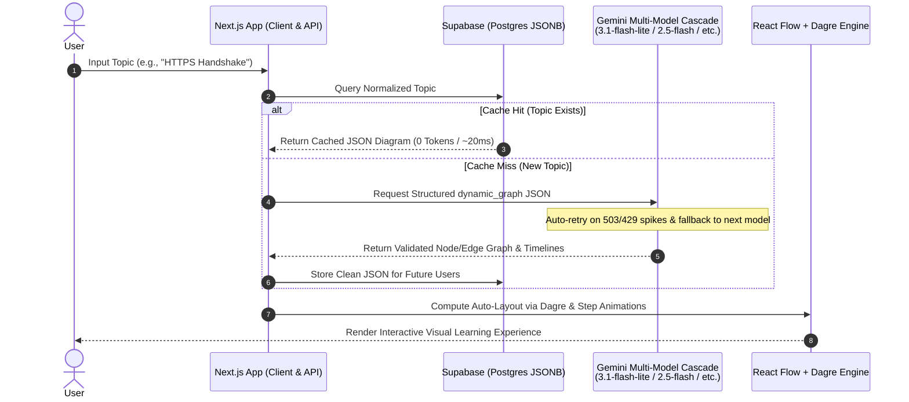

# Agentic Canvas 🎓⚡

> **Learn & Visualize Anything Instantly.**  
> An intelligent, production-ready AI engine that converts complex topics into dynamic, interactive diagrams with zero-token caching architecture.

[](https://nextjs.org/)
[](https://www.typescriptlang.org/)
[](https://aistudio.google.com/)
[](https://supabase.com/)
[](https://tailwindcss.com/)
[](#license)

---

## 🌟 Overview

**Agentic Canvas** bridges the gap between text-heavy learning and visual cognition. By typing any concept—from *"Quantum Entanglement"* to *"Kubernetes Architecture"*—Agentic Canvas synthesizes the topic into a structured visual mind map, flowchart, and concise explanation in real time.

Built with **Next.js 14**, **Google Gemini AI**, and **Supabase**, this project demonstrates high-performance AI system design featuring a **zero-token cache layer** to minimize LLM API latency and cost.

---

## 🔥 Key Features

- **⚡ Instant Visual Generation:** Converts complex queries into intuitive, interactive graph diagrams powered by React Flow, Dagre, and Framer Motion.
- **💰 Zero-Token Caching System:** Frequently searched topics are cached in PostgreSQL (Supabase) as JSON. Repeated queries take **0 tokens** and respond in ~20ms.
- **🛡️ Multi-Model Resilience & Auto-Fallback:** Automatically cascades across Google Gemini models (`gemini-3.1-flash-lite` → `gemini-2.5-flash` → `gemini-2.0-flash` → `gemini-1.5-flash`) with exponential backoff to eliminate 503 demand spikes.
- **🎨 Glassmorphic Canvas UI:** 600px interactive canvas featuring dynamic timeline step animations, node glow pulses, and fluid edge flows.
- **📱 Responsive & Cache Guarded:** Clean validation prevents broken JSON schemas and avoids polluting the database cache with dummy fallbacks.

---

## 🏗️ System Architecture



---

## 🛠️ Tech Stack

| Domain | Technology | Description |
| :--- | :--- | :--- |
| **Framework** | Next.js 14 (App Router) | React framework with Server Components & API routes |
| **Language** | TypeScript | Type-safe development across client and server |
| **AI Model & SDK** | Google Gemini (`@google/genai`) | Multi-model fallback cascade (`gemini-3.1-flash-lite`, `2.5-flash`, `2.0-flash`) |
| **Database** | Supabase (PostgreSQL) | Managed database used as a high-speed JSON cache |
| **Canvas Engine** | React Flow (`@xyflow/react`) + Dagre | Dynamic node/edge rendering with automated directed-graph layout |
| **Animations** | Framer Motion | Timeline-driven pulse, highlight, and edge flow animations |
| **Styling** | Tailwind CSS | Modern glassmorphic design system with clean typography |

---

## 🚀 Quick Start Guide

### Prerequisites
- Node.js `v18.x` or higher installed
- npm or pnpm
- Google Gemini API Key (Free)
- Supabase Account & Database (Free)

### 1. Clone the Repository
```bash
git clone https://github.com/Aftabmemon20/Agentic-Canvas.git
cd Agentic-Canvas
```

### 2. Install Dependencies
```bash
npm install
```

### 3. Configure Environment Variables
Create a `.env.local` file in the root directory:
```env
GEMINI_API_KEY=your_gemini_api_key_here
NEXT_PUBLIC_SUPABASE_URL=your_supabase_project_url
NEXT_PUBLIC_SUPABASE_ANON_KEY=your_supabase_anon_key
```

### 4. Database Setup (Supabase)
Navigate to your **Supabase Dashboard → SQL Editor** and execute:
```sql
create table visuals (
  id uuid default gen_random_uuid() primary key,
  topic text not null unique,
  data jsonb not null,
  created_at timestamp default now()
);

-- Index for instant lookup performance
create index idx_visuals_topic on visuals(topic);
```

### 5. Launch Development Server
```bash
npm run dev
```
Open `http://localhost:3000` in your browser.

---

## 📊 System Design & Optimizations

1. **Token Cost Minimization:**  
   LLM API calls are expensive and subject to strict rate limits. By normalizing search strings (lowercase, trimmed) and caching results in a `jsonb` column in Supabase, we reduce API usage by up to **80%** for popular topics.

2. **Schema Enforcement:**  
   The system prompts Gemini using strict JSON schema output requirements to ensure nodes, edges, and descriptions deserialize cleanly without client-side rendering crashes.

3. **Client-Side Rendering Isolation:**  
   Visual diagram components run purely on the client side using dynamic imports, ensuring zero server-side hydration mismatches.

---

## 💡 Architectural Decisions, Challenges & Engineering Learnings

Going from an experimental prototype ("works on my machine") to a resilient, production-ready system forced us to confront key distributed AI challenges:

### 1. The Dual-Renderer Pitfall: Why We Dropped Mermaid.js
- **The Problem:** We initially had Gemini generate both Mermaid syntax (`graph TD ...`) and node/edge JSON for React Flow. Mermaid frequently suffered syntax parse failures on special characters, doubled the token payload per request, and shipped unnecessary client-side bundle weight (~800KB+).
- **The Decision:** Unified entirely on a single rendering engine: **React Flow (`@xyflow/react`) + Dagre**. Dagre deterministically calculates node $(x, y)$ coordinates in milliseconds, while Framer Motion handles visual pulse and edge flow animations.
- **The Takeaway:** Don't ask an LLM to generate two representations of the exact same data. Pick the most expressive format and execute it cleanly.

### 2. Solving Transient 503s & Rate Spikes with Multi-Model Cascades
- **The Problem:** In production, LLM APIs experience unpredictable demand spikes (`503 UNAVAILABLE: "This model is currently experiencing high demand"`). Hardcoding a single model inevitably results in red error banners.
- **The Decision:** Built a resilient cascading caller using the `@google/genai` SDK:
  $$\text{gemini-3.1-flash-lite} \xrightarrow{\text{fallback}} \text{gemini-2.5-flash} \xrightarrow{\text{fallback}} \text{gemini-2.0-flash} \xrightarrow{\text{fallback}} \text{gemini-1.5-flash}$$
  Paired with exponential backoff retries, temporary capacity drops on one model resolve invisibly to the end user.
- **The Takeaway:** A production AI backend must be fault-tolerant by design. Never let a single model endpoint be a single point of failure.

### 3. Killing Dummy Mock Fallbacks to Protect Cache Integrity
- **The Problem:** Our early prototype caught API errors by generating a generic 3-step mock visual (*"Core Principle → Mechanism → Final Outcome"*) and writing it into Supabase. If the API had a brief glitch, that topic was permanently corrupted in the database cache—meaning future users forever received fake diagrams.
- **The Decision:** Completely eliminated silent dummy fallbacks. If all AI models fail after retries, the API surfaces an honest, user-friendly retry message and **never** poisons the cache.
- **The Takeaway:** Bad data in a cache is significantly worse than a clean retryable failure. Protect your cache integrity at all costs.

### 4. Canvas Geometry & Progressive Disclosure
- **The Problem:** A fixed 400px canvas with tight 150x50px node bounding boxes caused multi-word labels and descriptions to clip or overlap when complex flows were rendered.
- **The Decision:** Expanded the canvas to 600px (`h-[600px]`), tuned Dagre layout spacing to 220x80px bounding boxes, and added an animation timeline runner that progressively highlights nodes and pulses data flow.
- **The Takeaway:** Visual clarity requires both spatial room and temporal orchestration. Showing an entire graph at once is overwhelming; animating the steps sequentially turns static diagrams into active comprehension.

---

## 🗺️ Roadmap & Future Engineering Goals

- [ ] **Dockerization:** Package Frontend and Backend workers into isolated Docker containers.
- [ ] **Microservice Architecture:** Separate the AI generation agent into an independent microservice.
- [ ] **CI/CD Pipeline:** Automated build, test, and container deployment pipeline via GitHub Actions.
- [ ] **Cloud Deployment (AWS):** Deploy containerized nodes onto AWS EC2 / ECS Fargate using Infrastructure-as-Code.
- [ ] **Rate Limiting & Security:** Implement Redis-based rate limiting per IP and input sanitization against XSS attacks.
- [ ] **Shareable URLs:** Enable `/topic/[slug]` dynamic routes so users can share specific generated diagrams on social platforms like Twitter/LinkedIn.

---

## 🤝 Contributing

Contributions, issues, and feature requests are welcome!  
Feel free to check the [issues page](https://github.com/Aftabmemon20/Agentic-Canvas/issues).

---

## 📄 License

Distributed under the MIT License. See `LICENSE` for more information.

---

<p center="align">
  Built with ❤️ for building in public. Star ⭐️ this repo if you find it helpful!
</p>
