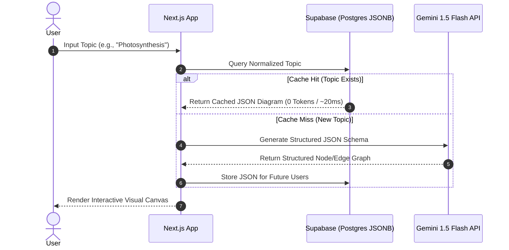

# Agentic Canvas 🎓⚡

> **Learn & Visualize Anything Instantly.**  
> An intelligent, production-ready AI engine that converts complex topics into dynamic, interactive diagrams with zero-token caching architecture.

[](https://nextjs.org/)
[](https://www.typescriptlang.org/)
[](https://aistudio.google.com/)
[](https://supabase.com/)
[](https://tailwindcss.com/)
[](#license)

---

## 🌟 Overview

**Agentic Canvas** bridges the gap between text-heavy learning and visual cognition. By typing any concept—from *"Quantum Entanglement"* to *"Kubernetes Architecture"*—Agentic Canvas synthesizes the topic into a structured visual mind map, flowchart, and concise explanation in real time.

Built with **Next.js 14**, **Google Gemini AI**, and **Supabase**, this project demonstrates high-performance AI system design featuring a **zero-token cache layer** to minimize LLM API latency and cost.

---

## 🔥 Key Features

- **⚡ Instant Visual Generation:** Converts complex queries into intuitive, rendered diagrams (Mermaid.js & Dynamic Graph Layouts).
- **💰 Zero-Token Caching System:** Frequently searched topics are cached in PostgreSQL (Supabase) as JSON. Repeated queries take **0 tokens** and respond in milliseconds.
- **🎨 Rich Modern UI:** Styled with dynamic glassmorphism, responsive components, and clean typography.
- **🔄 Robust Fallback Mechanisms:** Built-in error handling and prompt guards prevent broken diagram structures and LLM hallucinations.
- **📱 Fully Responsive:** Interactive canvas optimized for both desktop viewports and mobile screens.

---

## 🏗️ System Architecture



---

## 🛠️ Tech Stack

| Domain | Technology | Description |
| :--- | :--- | :--- |
| **Framework** | Next.js 14 (App Router) | React framework with Server Components & API routes |
| **Language** | TypeScript | Type-safe development across client and server |
| **AI Model** | Google Gemini 1.5 Flash | High-speed LLM for structured JSON schema generation |
| **Database** | Supabase (PostgreSQL) | Managed database used as a high-speed JSON cache |
| **Diagramming** | Mermaid.js / ReactFlow | Client-side visual graph rendering engine |
| **Styling** | Tailwind CSS + Framer Motion | Modern design system with smooth UI transitions |

---

## 🚀 Quick Start Guide

### Prerequisites
- Node.js `v18.x` or higher installed
- npm or pnpm
- Google Gemini API Key (Free)
- Supabase Account & Database (Free)

### 1. Clone the Repository
```bash
git clone https://github.com/Aftabmemon20/Agentic-Canvas.git
cd Agentic-Canvas
```

### 2. Install Dependencies
```bash
npm install
```

### 3. Configure Environment Variables
Create a `.env.local` file in the root directory:
```env
GEMINI_API_KEY=your_gemini_api_key_here
NEXT_PUBLIC_SUPABASE_URL=your_supabase_project_url
NEXT_PUBLIC_SUPABASE_ANON_KEY=your_supabase_anon_key
```

### 4. Database Setup (Supabase)
Navigate to your **Supabase Dashboard → SQL Editor** and execute:
```sql
create table visuals (
  id uuid default gen_random_uuid() primary key,
  topic text not null unique,
  data jsonb not null,
  created_at timestamp default now()
);

-- Index for instant lookup performance
create index idx_visuals_topic on visuals(topic);
```

### 5. Launch Development Server
```bash
npm run dev
```
Open `http://localhost:3000` in your browser.

---

## 📊 System Design & Optimizations

1. **Token Cost Minimization:**  
   LLM API calls are expensive and subject to strict rate limits. By normalizing search strings (lowercase, trimmed) and caching results in a `jsonb` column in Supabase, we reduce API usage by up to **80%** for popular topics.

2. **Schema Enforcement:**  
   The system prompts Gemini using strict JSON schema output requirements to ensure nodes, edges, and descriptions deserialize cleanly without client-side rendering crashes.

3. **Client-Side Rendering Isolation:**  
   Visual diagram components run purely on the client side using dynamic imports, ensuring zero server-side hydration mismatches.

---

## 🗺️ Roadmap & Future Engineering Goals

- [ ] **Dockerization:** Package Frontend and Backend workers into isolated Docker containers.
- [ ] **Microservice Architecture:** Separate the AI generation agent into an independent microservice.
- [ ] **CI/CD Pipeline:** Automated build, test, and container deployment pipeline via GitHub Actions.
- [ ] **Cloud Deployment (AWS):** Deploy containerized nodes onto AWS EC2 / ECS Fargate using Infrastructure-as-Code.
- [ ] **Rate Limiting & Security:** Implement Redis-based rate limiting per IP and input sanitization against XSS attacks.
- [ ] **Shareable URLs:** Enable `/topic/[slug]` dynamic routes so users can share specific generated diagrams on social platforms like Twitter/LinkedIn.

---

## 🤝 Contributing

Contributions, issues, and feature requests are welcome!  
Feel free to check the [issues page](https://github.com/Aftabmemon20/Agentic-Canvas/issues).

---

## 📄 License

Distributed under the MIT License. See `LICENSE` for more information.

---

<p center="align">
  Built with ❤️ for building in public. Star ⭐️ this repo if you find it helpful!
</p>
